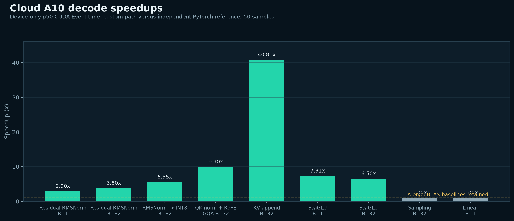
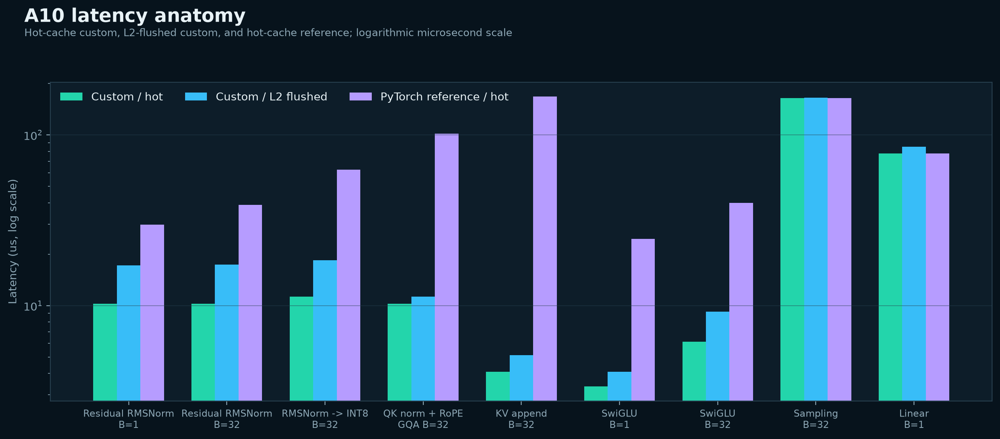
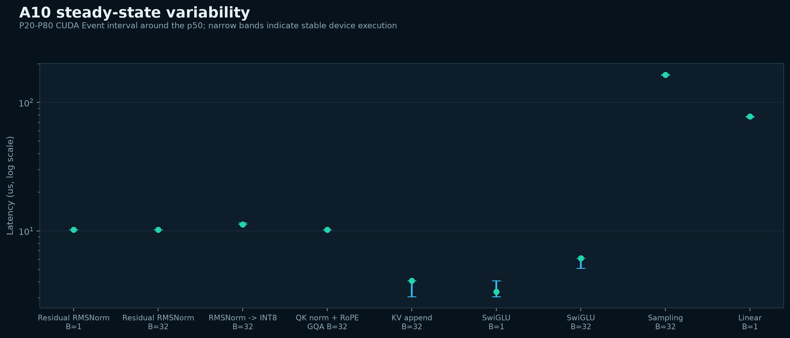
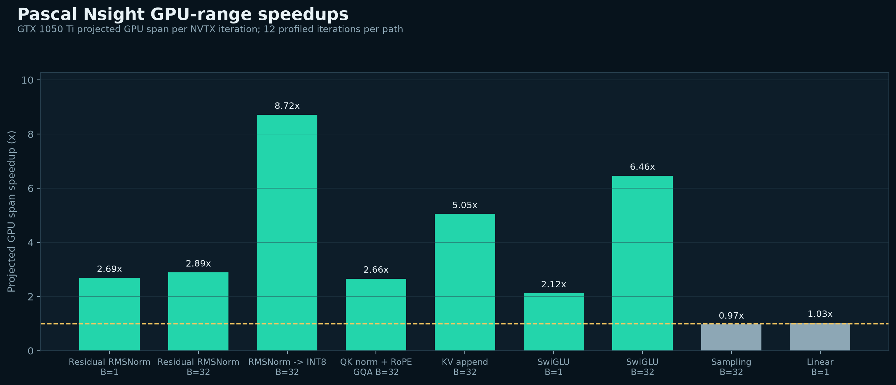
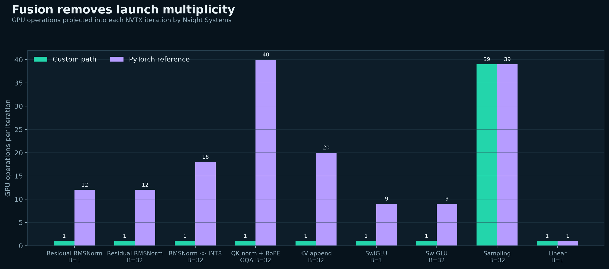
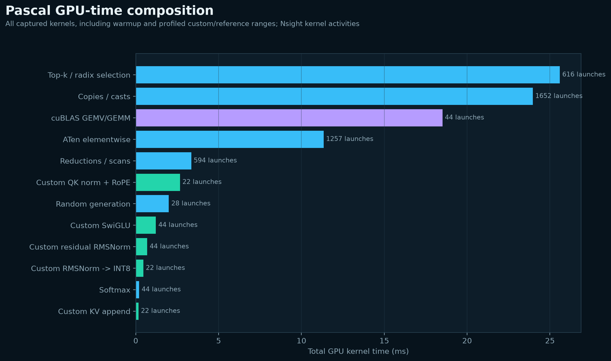
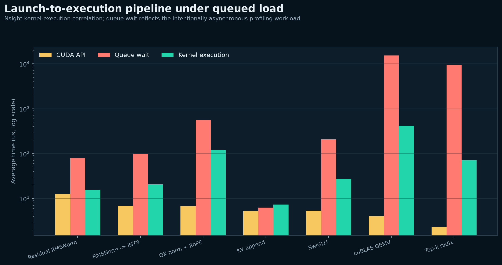
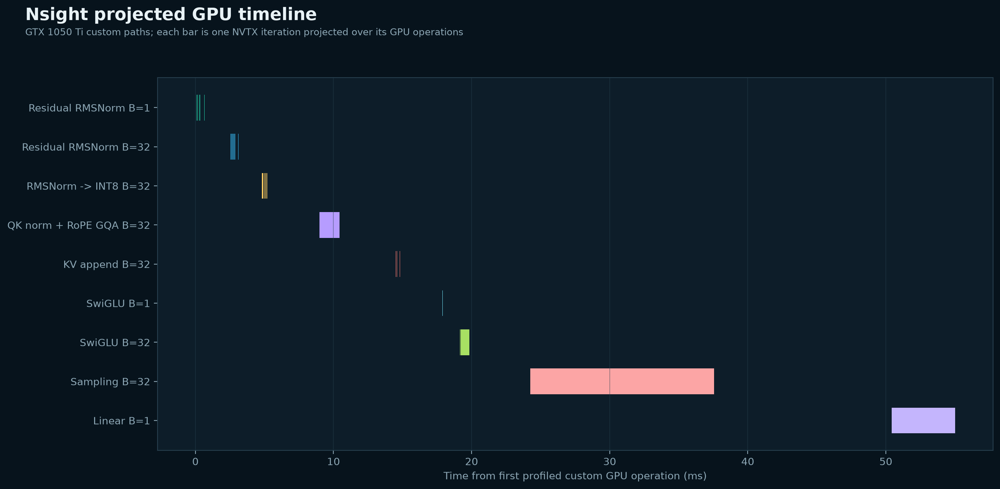
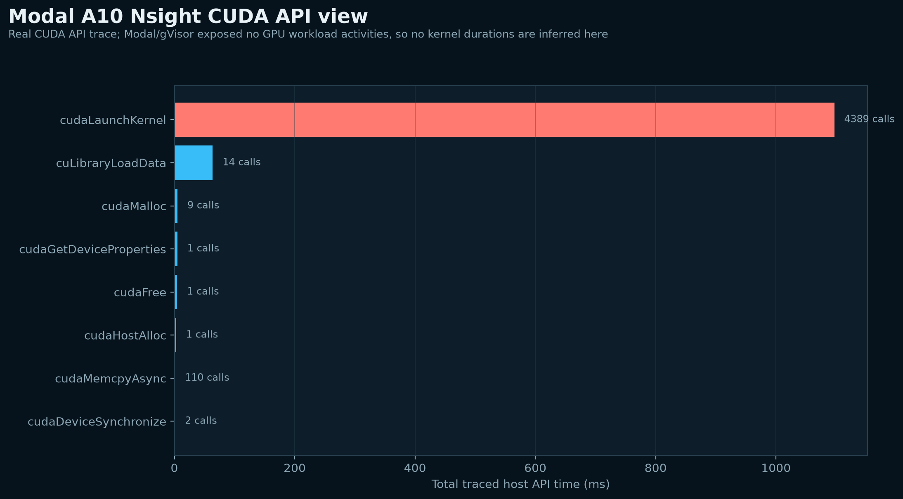

# Decode Kernels: Benchmark and Nsight Systems Analysis

## Executive result

The fused CUDA operators reduce both GPU work and launch count on two very
different devices:

- Modal NVIDIA A10 (SM 8.6): device-only p50 speedups range from **2.90x to
  40.81x** for the five compiled operator families.
- Physical GTX 1050 Ti (SM 6.1): Nsight-projected GPU-range speedups range from
  **2.12x to 8.72x** for the same fused families.
- Sampling and small-N linear remain explicit ATen/cuBLAS baselines. Both were
  approximately 1.0x, so the repository does not claim specialized speedups for
  them.

The mechanism is visible in the trace: residual RMSNorm falls from 12 GPU
operations to 1, RMSNorm-to-INT8 from 18 to 1, QK norm + RoPE from 40 to 1,
KV append from 20 to 1, and SwiGLU from 9 to 1.

## Evidence map

| Evidence | Hardware | What it establishes |
|---|---|---|
| `modal_a10g_decode_validation.json` | NVIDIA A10, SM 8.6 | Correctness plus hot/cold CUDA Event latency distributions |
| `decode_a10_nsys.nsys-rep` and SQLite | NVIDIA A10, SM 8.6 | Real Modal CUDA API and NVTX trace; no GPU workload activity exposed by Modal/gVisor |
| `decode_gtx1050ti_nsys.nsys-rep` and SQLite | GTX 1050 Ti, SM 6.1 | Real CUDA kernel activities, NVTX-to-GPU projection, launch correlation, and timeline |
| `decode_performance_analysis.json` | Both | Derived, machine-readable values used by every graph |
| `nsys/manifest.json` | Both | SHA-256 hashes, sizes, profiler versions, and SQLite activity counts |

The A10 and Pascal results are separate experiments. Device latencies are never
silently substituted across hardware.

## Cloud A10 results



| Trace | Custom hot p50 | Reference hot p50 | Speedup |
|---|---:|---:|---:|
| Residual RMSNorm, B=1 | 10.240 us | 29.696 us | 2.90x |
| Residual RMSNorm, B=32 | 10.240 us | 38.912 us | 3.80x |
| RMSNorm to INT8, B=32 | 11.264 us | 62.464 us | 5.55x |
| QK norm + RoPE, GQA B=32 | 10.240 us | 101.376 us | 9.90x |
| KV append, B=32 | 4.096 us | 167.168 us | 40.81x |
| SwiGLU, B=1 | 3.360 us | 24.576 us | 7.31x |
| SwiGLU, B=32 | 6.144 us | 39.936 us | 6.50x |
| Sampling, B=32 | 163.840 us | 163.840 us | 1.00x |
| Small-N linear, B=1 | 77.824 us | 77.824 us | 1.00x |



The cold-cache series executes a 64 MiB L2 flush before each measured sample.
The fused paths remain low-latency, but KV append and SwiGLU show the expected
memory-residency sensitivity. Sampling and 4096x4096 GEMV are dominated by
their selection and weight-read workloads rather than the small fused kernels.



Each marker is the p50 of 50 device-only CUDA Event samples; whiskers span p20
to p80. Events were queued behind an untimed GPU lead-in so Python dispatch gaps
cannot be misreported as kernel execution.

## Kernel-level Nsight evidence on Pascal



The Pascal values use Nsight NVTX GPU projection, divided by 12 instrumented
iterations. They represent the span from the first to last GPU operation in
each operator iteration. For single-kernel fused paths, that span is the kernel
duration. Multi-kernel reference spans include inter-kernel gaps.

| Trace | Custom GPU span | Reference GPU span | Speedup | GPU ops custom -> reference |
|---|---:|---:|---:|---:|
| Residual RMSNorm, B=1 | 55.10 us | 148.17 us | 2.69x | 1 -> 12 |
| Residual RMSNorm, B=32 | 48.25 us | 139.48 us | 2.89x | 1 -> 12 |
| RMSNorm to INT8, B=32 | 35.49 us | 309.36 us | 8.72x | 1 -> 18 |
| QK norm + RoPE, GQA B=32 | 120.90 us | 321.91 us | 2.66x | 1 -> 40 |
| KV append, B=32 | 41.02 us | 206.98 us | 5.05x | 1 -> 20 |
| SwiGLU, B=1 | 43.21 us | 91.74 us | 2.12x | 1 -> 9 |
| SwiGLU, B=32 | 57.12 us | 369.00 us | 6.46x | 1 -> 9 |
| Sampling, B=32 | 1109.43 us | 1071.24 us | 0.97x | 39 -> 39 |
| Small-N linear, B=1 | 381.79 us | 392.77 us | 1.03x | 1 -> 1 |



This is the clearest causal result. The speedups are not explained by a charting
artifact: Nsight directly projects fewer GPU activities into each fused NVTX
range. Sampling and linear intentionally show no launch-count reduction.

## Underlying kernel behavior

The custom kernel configurations recorded by Nsight are:

| Kernel/shape | Grid | Block | Median GPU time |
|---|---:|---:|---:|
| Residual RMSNorm, B=1 | 1 | 256 | 10.80 us |
| Residual RMSNorm, B=32 | 32 | 256 | 18.86 us |
| RMSNorm to INT8, B=32 | 32 | 256 | 20.50 us |
| QK norm + RoPE, GQA B=32 | 1280 | 256 | 121.10 us |
| KV append, B=32 | 128 | 256 | 7.20 us |
| SwiGLU, B=1 | 43 | 256 | 3.26 us |
| SwiGLU, B=32 | 1376 | 256 | 47.82 us |

Each kernel has 22 captured instances: 10 warmup launches plus 12 profiled
launches. This makes the kernel summary internally consistent with the workload.



The dominant total GPU costs are not the fused kernels. They are top-k/radix
selection, conversion/copy kernels, cuBLAS GEMV, and unfused ATen elementwise
work. This supports two concrete next targets:

1. Replace the 39-operation sampling pipeline only if an exact fused selection
   kernel can beat the 1.0x baseline without weakening sampling semantics.
2. Keep small-N GEMV on cuBLAS until a Pascal-specific weight-streaming kernel
   demonstrates an end-to-end crossover.



The queue-wait bars are large because the profiling workload deliberately
enqueues repeated asynchronous iterations before one final synchronization.
They expose launch pressure but are not standalone request latency. The CUDA API
and kernel bars are the relevant per-launch components; end-to-end latency comes
from the separate synchronized benchmark harness.



The projected timeline shows compact one-kernel fused ranges followed by the
much longer sampling pipeline and the bandwidth-heavy 4096x4096 GEMV.

## Modal Nsight limitation, preserved as evidence



Nsight Systems 2026.4.1 collected 5,622 CUDA API events, including 4,389
`cudaLaunchKernel` calls, plus 456 NVTX events on Modal. Its diagnostics confirm
that the requested legacy/software-instrumented CUDA trace ran. However, the
export contains zero GPU kernel-activity rows and zero NVTX GPU-projection rows.

Therefore:

- the Modal report is used only for CUDA API and host-range analysis;
- A10 GPU durations come from CUDA Events, not invented Nsight kernel rows;
- the physical Pascal trace supplies the kernel-level Nsight analysis.

This boundary is encoded in `decode_performance_analysis.json` and in the graph
subtitle so downstream readers cannot confuse API time with GPU execution time.

## Reproduction

Cloud correctness and benchmark run:

```bash
.venv/bin/python -m modal run modal/run_decode_gpu.py --warmup 10 --iterations 50
```

Cloud Nsight API/NVTX capture and retrieval:

```bash
.venv/bin/python -m modal run modal/profile_decode_nsys.py --iterations 12
.venv/bin/python -m modal volume get cuda-ml-nsys / artifacts/nsys --force
```

Physical Pascal kernel capture:

```bash
PROFILE_ITERATIONS=12 decode_kernels/benchmarks/profile_pascal_nsys.sh
```

Regenerate all PNG, SVG, and derived JSON outputs:

```bash
.venv/bin/pip install -r decode_kernels/requirements-analysis.txt
.venv/bin/python decode_kernels/benchmarks/generate_analysis_graphs.py
```

## Scope and caveats

- Shapes are labelled synthetic 7B-class decoder assumptions, not captured
  production traffic.
- A10 and Pascal software stacks differ and are not compared as if they were
  the same GPU.
- CUDA Event and Nsight GPU-projection methodologies measure different things;
  they are reported in separate figures.
- This is an operator-level study. It does not yet establish full-model
  tokens/second, time-to-first-token, or concurrency behavior.
